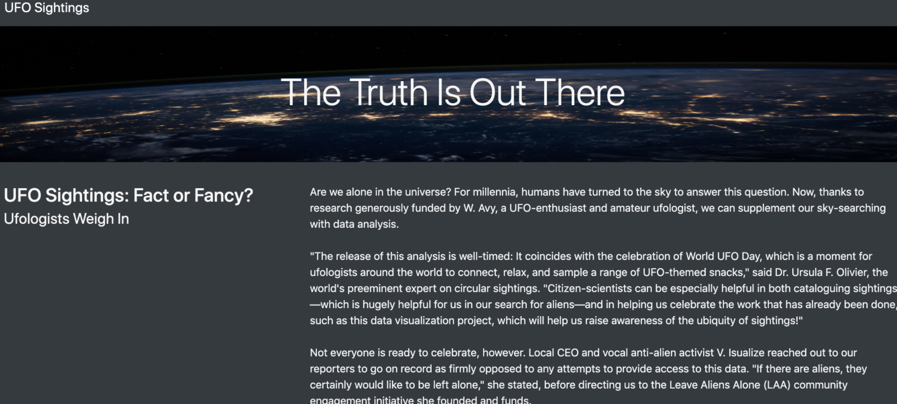
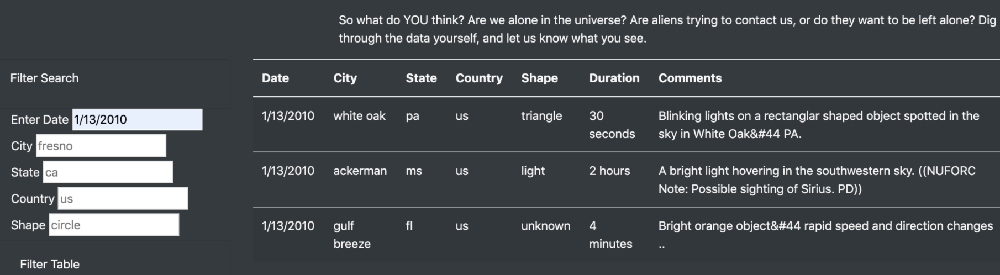

# Overview
Create a webpage with information regarding UFOs. The webpage will consist of an article, article summary, header, and an interactive table with multiple filters. The information was scrapped from various websites
  * Rendered in the app.js file.

## Tools/ Languages Used: 
* JavaScript 
* HTML
* CSS
* Bootstrap

# Visuals

A sample of the website and dashboard.
